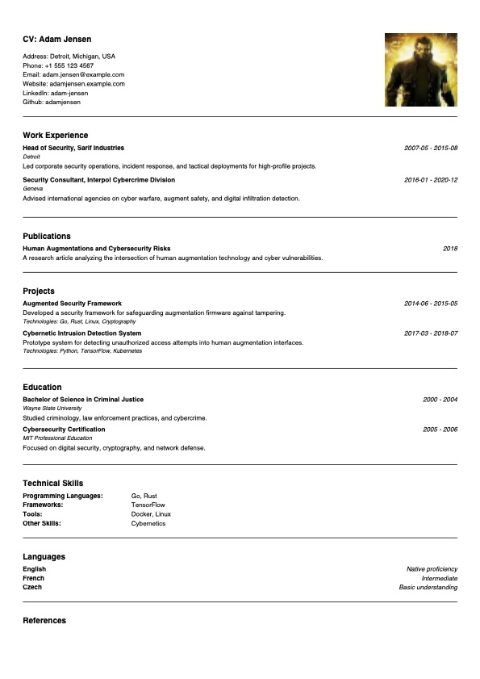

# Jxbscare
*A cursed 👻 CV-to-PDF generator written in Go*

[](https://goreportcard.com/report/github.com/wsand02/jxbscare)

[](https://github.com/wsand02/jxbscare/blob/master/LICENSE)
[](https://github.com/wsand02/jxbscare/)

## Overview
Jxbscare (j-word censored for fellow CS student friendliness) is a CV-to-PDF generator using TOML and Maroto and is implemented in Go.

Originally this project had its own custom DSL powered by ANTLR, but that dream was scrapped in favor of TOML and hardcoded layouts. The remains of that grand experiment can still be found in the git history.

## ⚠️ Disclaimer  
This project is *experimental*.  
- Only tested on **A4 paper size** (I'm not even sure the generated PDFs conform to the A4 paper size 😅).  
- May break if you look at it wrong.
- Needs much more testing and refinement.

## Installation
I don't believe in distributing binaries (I don't have the means to sign them), you'll need to build it yourself:
```
git clone https://github.com/wsand02/jxbscare.git
cd jxbscare
make
```

## Usage

### Web interface
Coming soon...

### CLI
```
./bin/jxbscare-cli <input.toml> <output.pdf> 
```
* `<input.toml>` CV data in TOML format
* `<output.pdf>` Generated CV in PDF format

## Example
Check out the provided [example toml](cv.example.toml) featuring Adam Jensen (he definitely didn't ask for this). **⚠️ Note that some fields are yet to be implemented.**




## License
Jxbscare is licensed under the [MIT License](LICENSE).